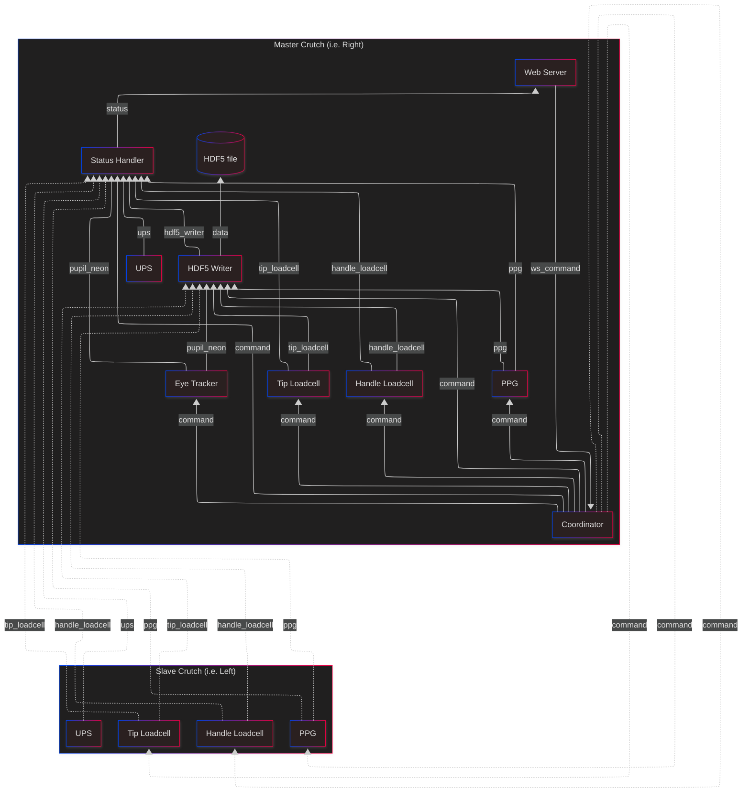

# Instrumented Crutches

This repository contains an instrumented crutches system built on top of [MADS](https://github.com/pbosetti/MADS) (Multi-Agent Distributed System). 

**MADS** is a flexible, plugin-based framework for real-time data acquisition, processing, and distribution. It provides a modular architecture where different components (sources, filters, sinks) can be easily composed to create data processing pipelines. The system uses a publish/subscribe messaging pattern for inter-component communication and supports distributed deployments.

This project implements MADS plugins for collecting and processing data from instrumented crutches, including tip load cells, eye tracking, and coordination between multiple sensors. For more information about MADS, visit the [official documentation](https://mads-net.github.io/).

For the Instrumented Crutches documentation, visit the online [docs](https://mmtlab.github.io/instrumented_crutches_mads/index.html).

*Required MADS version: [2.0.0](https://github.com/pbosetti/MADS/releases/tag/v2.0.0)*

## Installation

First, clone the repository:

```bash
git clone https://github.com/mmtlab/instrumented_crutches_mads.git
cd instrumented_crutches_mads
```

Each agent must be installed separately. See the `README.md` files inside each agent folder for details. 

**Important note**: Not all agents are required on both crutches. Compile only the agents needed for each crutch role:

- **Master crutch** (i.e. right): web_server, coordinator, status_handler, hdf5_writer, tip_loadcell, eye_tracker, ups, ppg
- **Slave crutch** (i.e. left): tip_loadcell, ups, ppg

### Settings file - mads.ini
Check the `mads.ini` configuration (i.e. the tip load cells' scaling factors) and run this command from the repository root if you want to overwrite the existing file:

```bash
sudo cp templates/mads.ini /usr/local/etc/
```

***Note***: provide write permissions to the data folder used by `web_server` and `hdf5_writer` (by default `web_server/data`), otherwise startup can fail.

If needed, fix ownership/permissions with:

```bash
sudo chown -R $USER:$USER ~/instrumented_crutches_mads/web_server/data
chmod -R u+rwX ~/instrumented_crutches_mads/web_server/data
```

### Enable services

Enable services according to the crutch role.

On the master crutch (i.e. right crutch), copy the service files to `/etc/systemd/system`:

```bash
sudo cp templates/mads-broker.service templates/mads-web_server.service templates/mads-coordinator.service templates/mads-status_handler.service templates/mads-hdf5_writer.service templates/mads-eye_tracker.service templates/mads-network_handler.service templates/right/mads-tip_loadcell.service templates/right/mads-handle_loadcell.service templates/right/mads-ups.service templates/right/mads-ppg.service /etc/systemd/system/
```

Then enable them:

```bash
sudo systemctl enable mads-broker.service mads-web_server.service mads-coordinator.service mads-status_handler.service mads-hdf5_writer.service mads-tip_loadcell.service mads-handle_loadcell.service mads-eye_tracker.service mads-network_handler.service mads-ups.service mads-ppg.service
```

On the slave crutch (i.e. left crutch), copy the service file to `/etc/systemd/system`:

```bash
sudo cp templates/left/mads-tip_loadcell.service templates/left/mads-handle_loadcell.service templates/left/mads-ups.service templates/left/mads-ppg.service /etc/systemd/system/
```

Then enable it:

```bash
sudo systemctl enable mads-tip_loadcell.service mads-handle_loadcell.service mads-ups.service mads-ppg.service
```

Use the pre-configured service files in `templates/left` and `templates/right` for the correct crutch side.

For the Python agent, check the paths in the service file and adapt them to the current configuration.

All enabled services start their agents automatically at boot.


### Configure network

On the master crutch Raspberry Pi, create a Wi-Fi hotspot:

```bash
sudo nmcli device wifi hotspot ssid <network-name> password <network-password>
```

On the slave crutch Raspberry Pi, configure the connection to that hotspot and enable auto-connect:

```bash
sudo nmcli connection modify <connection-name> connection.autoconnect yes
sudo nmcli connection up <connection-name>
```


### Configure NTP synchronization

Install chrony by running:

```bash
sudo apt install chrony
```

Copy the configuration file to `/etc/chrony`:

```bash
sudo cp templates/chrony.conf /etc/chrony/
```

Enable and restart the service:

```bash
sudo systemctl enable chrony
sudo systemctl restart chrony
```

Run this NTP configuration on both crutches.

***Important note***: the NTP configuration file (`chrony.conf`) uses `10.42.0.1` as the default server IP.
Check the master crutch hotspot IP address and update the file accordingly before copying it to `/etc/chrony/`.


## Acquisition board case
You can find the acquisition board case STL files in the `templates/case` folder for 3D printing.

## Architecture



Each instrumented crutch runs on a Raspberry Pi Zero 2 W and uses MADS agents for sensing, control, and communication.
In this architecture, some agents run only on the master crutch, while others run on both crutches.

Master-only services
- **Web Server**: provides the Record/View/Download UI and sends control commands.
- **Coordinator**: receives web commands and orchestrates acquisition lifecycle across agents.
- **Status Handler**: aggregates startup/health/error/shutdown events and publishes system status.
- **HDF5 Writer**: logs incoming topics into structured HDF5 files for each acquisition.
- **Eye Tracker (Pupil Neon)**: manages discovery/connection/recording and publishes sync statistics.

Services deployed on both crutches
- **Tip Loadcell**: acquires axial load from the tip sensor.
- **Handle Loadcell**: acquires multi-channel handle forces.
- **PPG**: acquires photoplethysmography data.
- **UPS**: publishes battery and power metrics.


## Usage

Recommended workflow (Web interface):

1. Power on the master crutch (default: **right**) and wait for services to start.
2. Connect a PC/tablet/smartphone to the master hotspot.
3. Open `http://10.42.0.1:8000` in your browser (the **Record** page).
4. In the **Status** panel, click **Update Datetime** to immediately sync the master date/time.
5. Power on the slave crutch (left): it will auto-connect to the hotspot and sync time via NTP after about 1-2 minutes.
6. In the **Status** panel, verify that the main nodes are reachable (tip/handle/ppg, logger, coordinator; eye-tracker if used).
7. Run calibration in **Calibration** with the **Calibrate** button and check updated values/indicators. **Note:** keep the crutch lifted off the ground and do not press the handle, otherwise the offset calibration will be invalid.
8. (Optional) In the **Eye-tracker** section, click **Connect** and verify the status becomes *Connected*. **Note:** for discovery to work, the Pupil Neon must be paired with its smartphone, and must be connected to the same network as the master crutch.
9. Fill in **Test Configuration** fields (Subject ID, Session ID, Height, Weight, Crutch Height).
10. (Optional) Add notes in **Comments**.
11. (Optional) Click **Condition** and select the current condition.
12. Click **Start** to begin recording.
13. During acquisition, monitor **Status** and confirm services/sensors are in a recording-consistent state.
14. If the condition changes during the test, use **Condition** again. The timestamp of each new condition is recorded.
15. Click **Stop** to end the acquisition.

Note: each acquisition is assigned an incremental ID (shown as `Recording ID`).

After recording:

- **View Data**: select Subject, Session, and Recording to display charts.
- **Download**: download CSV files (`force_ID.csv` and `info_ID.csv`).
